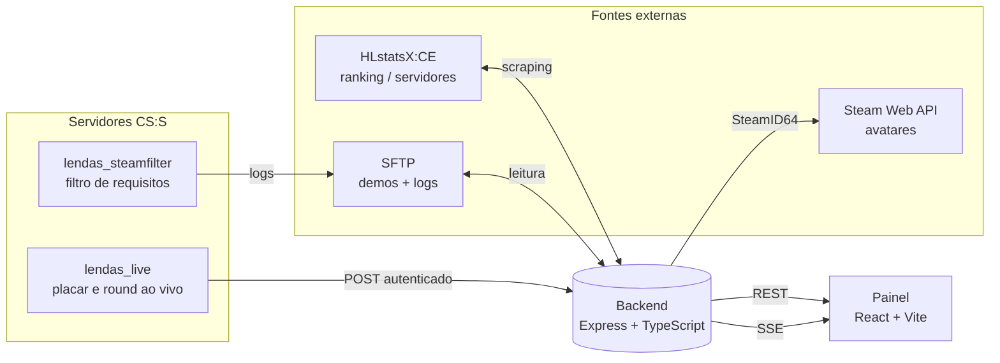

# LENDAS Network

Painel web da comunidade **L.E.N.D.A.S.**, uma rede de servidores
Counter-Strike: Source. Mostra status de servidor, ranking, catálogo de
demos, banimentos e placar ao vivo — tudo puxado de fontes reais, sem dado
inventado: quando uma informação não existe na fonte, o painel diz isso
explicitamente em vez de fingir.

## Arquitetura



Nada de mock escondido atrás de uma API bonita: cada dado que o painel
mostra tem uma fonte real identificável, documentada abaixo.

## Estrutura

```
painel/   → frontend (React 19, TypeScript, Vite, Tailwind v4)
server/   → backend próprio (Express, TypeScript, zod)
```

O plugin SourceMod (`lendas_live`, que alimenta o placar ao vivo) roda nos
servidores de jogo e não faz parte deste repositório — o backend só recebe
o que ele manda via HTTP autenticado.

## Integrações reais

| Dado | Fonte | Como |
|---|---|---|
| Servidores, mapa, lotação | HLstatsX:CE | Scraping de HTML (sem API estruturada) |
| Ranking de jogadores | HLstatsX:CE | Scraping de HTML |
| Catálogo de demos | SFTP do servidor | Descoberta automática de pastas |
| Atividade (entradas/bloqueios) | Logs do `lendas_steamfilter` | Lidos via SFTP, mesma conexão das demos |
| Placar, round, scoreboard ao vivo | Plugin `lendas_live` | POST autenticado → SSE |
| Avatar de jogador ao vivo | Steam Web API | Resolvido pelo backend a partir do SteamID64 real |

## Limitações conhecidas (documentadas, não escondidas)

- Não existe evento de "saída" no feed de atividade — o plugin de
  requisitos não loga desconexão, só o veredito da entrada.
- Avatar de jogador no ranking histórico não é obtível (a instalação do
  HLstatsX trava ao renderizar o perfil individual de qualquer conta com
  avatar Steam real) — só jogadores **ao vivo** têm avatar real, resolvido
  via SteamID64 capturado pelo plugin.
- "Intervalo" (halftime) nunca aparece na fase da partida — o CS:S clássico
  não dispara um evento confiável pra essa transição.

## Rodando localmente

Requer Node 20+.

```bash
# Backend
cd server
npm install
cp .env.example .env   # preencha com credenciais reais
npm run dev             # http://localhost:8787

# Frontend (outro terminal)
cd painel
npm install
cp .env.example .env
npm run dev              # http://localhost:5173
```

Sem preencher o `.env` do backend, cada integração real fica indisponível
de forma explícita (nunca cai num mock disfarçado) — os detalhes de cada
variável estão comentados no próprio `.env.example` de cada pacote.

## Scripts

Em `painel/` e `server/`:

```bash
npm run dev         # ambiente de desenvolvimento
npm run build       # build de produção
npm test            # suíte de testes (só existe em server/)
npm run lint         # lint
npm run typecheck    # checagem de tipos (server/)
```

## Documentação mais a fundo

- `server/README.md` — endpoints, contratos, modelo de segurança de cada
  integração (demos, HLstatsX, filtro de requisitos, live).
